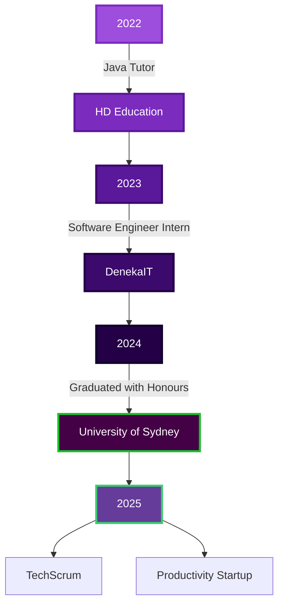

<!-- Animated Wave -->

<!-- Typing Animation -->

  

<!-- Social Links -->

  
  
  
  

<!-- Snake Animation --> 
  
 <!-- Visitor Counter --> 
  
 <!-- Connect Section --> <h3 align="center">  Let's Connect and Build Something Amazing Together!  </h3> 
 <i>Open to collaborating on innovative projects and always excited to connect with fellow developers!</i> 

<!-- About Me Section with Gradient Border -->

  
  <h2>
    
    About Me
    
  </h2>

### 🎯 Currently
- 🚀 Building scalable solutions at a productivity startup using **Next.js** & **AWS**
- 🔨 Implementing **Serverless Architecture** with Lambda & DynamoDB
- 👥 Developing **live collaboration features** with Liveblocks
- 🌱 Exploring advanced cloud patterns and microservices

### 💡 Background
- 🎓 **1st Class Honours** in Software Engineering from University of Sydney
- 👨‍🏫 2+ years tutoring **Java Design Patterns** & **SOLID Principles**
- 🏆 **1st Place Winner** - Tutor10x Backend Hackathon
- 🤝 Mentored 10+ students as PEP Mentor at University of Sydney

 

<!-- Tech Stack Section -->
<h2 align="center">
  
  Tech Stack
  
</h2>

<b>🎨 Frontend</b>

 

  
  
  
  
  
  
  

<b>⚙️ Backend</b>

 

  
  
  
  
  
  

<b>🗄️ Database & Cloud</b>

 

  
  
  
  
  
  

<b>🛠️ Tools & Others</b>

 

  
  
  
  
  
  
  

<!-- Experience Timeline -->
<h2 align="center">
  
  Professional Journey
  
</h2>

Skill	Progress
<!-- Featured Projects --> <h2 align="center">  Featured Projects  </h2> 
   
 <!-- GitHub Stats --> <h2 align="center">  GitHub Analytics  </h2> 
   
 
   

<!-- Activity Graph --> <h2 align="center">  Contribution Graph  </h2> 
  
 <!-- Trophies --> <h2 align="center">  GitHub Trophies  </h2> 
  
 <!-- Skills Progress Bars --> <h2 align="center">  

 

<!-- Current Work Section -->
## 🔭 Current Focus

  <table>
    <tr>
      <td align="center" width="50%">
        
          
        <b>Building with:</b> 
        Next.js • AWS Lambda • DynamoDB • S3
      </td>
      <td align="center" width="50%">
        
          
        <b>Implementing:</b> 
        Liveblocks • Real-time Features • WebSockets
      </td>
    </tr>
  </table>

