<!-- Animated Wave Header -->

  

<!-- Typing Animation -->

  

<!-- Social Links -->

  
  
  
  

 

 <!-- Snake Animation --> 
 <picture> <source media="(prefers-color-scheme: dark)" srcset="https://raw.githubusercontent.com/Interesting2/Interesting2/main/dist/github-contribution-grid-snake-dark.svg" /> <source media="(prefers-color-scheme: light)" srcset="https://raw.githubusercontent.com/Interesting2/Interesting2/main/dist/github-contribution-grid-snake.svg" />  </picture> 

  

<!-- About Section with Gradient Border -->

  

##  About Me

🎓 Software Engineering Graduate with 1st Class Honours from The University of Sydney

💼 Currently: Building real-time collaboration features at a productivity startup

🚀 Experience: 3+ years in full-stack development, from startups to SaaS platforms

👨‍🏫 Mentor: 2+ years tutoring software design patterns and principles

🛠️ Recent Work: Deployed 14 AWS Lambda functions and configured DynamoDB for scalable architecture

🌱 Learning: Live collaboration with Liveblocks and advanced cloud architectures

💡 Passionate About: Building meaningful products that solve real problems

 

<!-- Current Work Section -->
## 🔭 Current Focus

  <table>
    <tr>
      <td align="center" width="50%">
        
          
        <b>Building with:</b> 
        Next.js • AWS Lambda • DynamoDB • S3
      </td>
      <td align="center" width="50%">
        
          
        <b>Implementing:</b> 
        Liveblocks • Real-time Features • WebSockets
      </td>
    </tr>
  </table>

<!-- Tech Stack Section -->
## 💻 Tech Stack

### Languages

### Frontend

### Backend

### Database

### Cloud & DevOps

### Tools & Others

<!-- Experience Timeline -->
## 💼 Professional Journey

```mermaid
graph LR
    A[2022] -->|Java Tutor| B[HD Education]
    B --> C[2023]
    C -->|Software Engineer Intern| D[DenekaIT]
    D --> E[2024]
    E -->|Graduated with Honours| F[University of Sydney]
    F --> G[2025]
    G -->|Full-Stack Developer| H[TechScrum]
    H -->|Current| I[Productivity Startup]
    
    style A fill:#B794F6
    style C fill:#9333EA
    style E fill:#7C3AED
    style G fill:#6B46C1
    style I fill:#553C9A
```

  

## 📊 GitHub Analytics

   
 
  
 <!-- Activity Graph --> 
  

## 🏆 Achievements & Highlights

🎯 Achievement	📝 Description
🥇 Hackathon Winner	1st place at Tutor10x Backend Hackathon using MongoDB, AWS Lambda & S3
🎓 1st Class Honours	Graduated with distinction on thesis project
👨‍🏫 50+ Tutoring Sessions	Taught Java design patterns improving student retention by 30%
🚀 14 Lambda Functions	Deployed serverless architecture in first week at current role
💳 Stripe Integration	Built multi-tenant SaaS billing with 100% accuracy
🎨 UI/UX Leadership	Designed 5+ high-fidelity mockups improving platform usability

## 🌟 Featured Projects

   

## 🎯 Core Competencies

text
Full-Stack Development  ████████████████████░  95%
Cloud Architecture      ████████████████░░░░░  80%
System Design          █████████████████░░░░  85%
Team Collaboration     ████████████████████░  95%
Problem Solving        ████████████████████░  95%
Mentoring & Teaching   █████████████████░░░░  85%

 <!-- Quote --> 
  
 <!-- Footer --> 
  
 <!-- Profile Views Counter --> 
  

